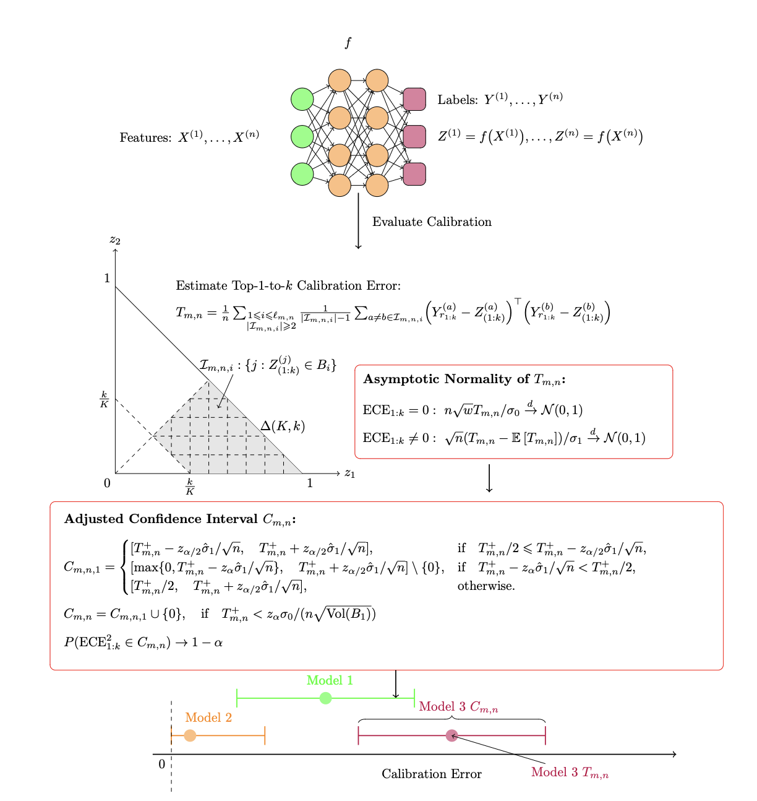

# A Confidence Interval for the $\ell_2$ Expected Calibration Error


This repository contains the implementation of the paper: **[A Confidence Interval for the $\ell_2$ Expected Calibration Error](https://arxiv.org/abs/2408.08998).**

## Overview



## Reproducibility
All simulation results in our paper can be reproduced with the code in `experiment/`.

Reproducing our simulation by:
```{python}
python run_simulation.py --setting simu1
```
To get results for all baselines, run:
```{sh}
bash run_simulation.sh
```